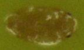
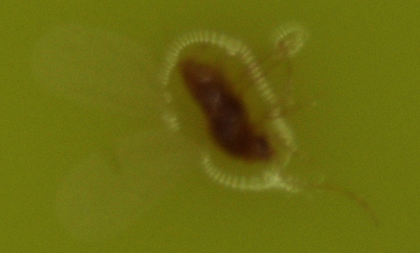

###Analyzed zoom1.JPG

#### Zoom 1
97.2 pixels per mm
image size = 2560 x 1920 pixels (4.9 megapixels)
image size = 26.34 x 19.75 mm

#### Zoom 2
194.4 pixels per mm
image size = 13.17 x 9.88 mm

#### Zoom 5
486 pixels per mm
5.27 x 3.95 mm

#### Crawler (DSL30001.JPG) zoom 5
body length = 121.5 pixels
body length = 0.250 mm

#### Male(DSL30004.JPG) zoom 5
body length = 199.6 pixels
body length = 0.411 mm

